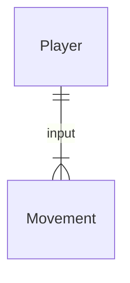

# Game "Jack In The Woods"
## 1.1 Latar Belakang
  Banyaknya game yang saat ini dimainkan oleh banyak orang, sudah sangat modern atau sangat canggih dengan grafik yang memukau dengan jauhnya perkembangan zaman, game retro menghadirkan nuansa nostalgia pada pemainnya. Ditambah game yang dimainkan oleh orang orang saat ini terlalu penuh tekanan atau stress, game retro rpg ini membawakan perasaan anti-stress atau chill saat dimainkan.

## 1.2. Deksripsi Teknologi Informasi
  Game "Jack In The Woods" ini merupakan game retro rpg yang membawakan perasaan chill saat bermain dengan experience
no stress. Game ini bercerita tentang seorang anak laki-laki yang berkelana ke hutan karena bosan dengan lingkungan kota, saat dia berada di hutan semua hal yang ia lakukan benar-benar bebas dan tidak terikat aturan "kota". Dia menetap di sebuah
rumah di desa dalam hutan. Dia bisa membantu warga menyelesaikan tugas, seperti menebang pohon di hutan, membawa sebuah
benda milik warga yang tertinggal, atau bisa bercocok tanam tanpa ada suruhan dari warga, atau juga bisa mengeksplor
map yang ada. Inti dari game ini player dapat melakukan tugas yang mana saja tanpa ada urutan yang tetap. Diharapkan
para player, bermain game ini sebagai sarana penghilang stress yang sederhana.

## 1.3. Branding
### 1.3.1. Nama/Merk Game :
Jack In The Woods
### 1.3.2. Tagline :
Gaming and chill without stress
### 1.3.3. Target User :
- Usia 15 tahun ke atas
- Pemain yang mencari ketenangan saat bermain game
- Pemain yang ingin bernostalgia dengan retro game
- Penikmat game indie
### 1.3.4. Genre :
Indie retro RPG
### 1.3.5. Poster :

### 1.3.6 Inspirasi Design :

## 2. User Story

Sebagai | Saya Ingin Bisa | Sehingga | Prioritas
---|---|---|---
PLayer | Bergerak ke mana saja | Bisa mengeksplorasi | ⭐⭐⭐⭐⭐
Player | Menabrak objek | Bisa berinteraksi dengan objek tertentu | ⭐⭐⭐⭐⭐
Player | Berinteraksi dengan NPC | Bisa menyelesaikan quest yang diberi | ⭐⭐⭐⭐⭐
Player | Bermain dengan musik berjalan di background | Nuansa chill / anti-stress tercipta | ⭐⭐⭐⭐⭐
Player | Menyimpan barang ke inventory | Bisa menyimpan barang | ⭐⭐⭐⭐
Player | Menebang pohon | Menyelesaikan quest menebang pohon | ⭐⭐⭐
Player | Save data | Data terakhir bisa tersimpan | ⭐⭐⭐
Player | Load data | Memuat data terakhir | ⭐⭐⭐
Player | Berpindah map | Bisa bereksplorasi | ⭐⭐⭐
Player | Masuk ke rumah | Bisa bereksplorasi | ⭐⭐⭐

## 3. Struktur Data

## 4. Arsitektur Sistem

(https://mermaid.js.org/syntax/flowchart.html)

## 5. Teknologi, Library, dan Framework
- Teknologi yang saya gunakan untuk membuat game yang satu ini adalah java
- Library yang saya gunakan adalah Java Standard Libraries (Java Swing, Java awt)
- Framework yang akan saya gunakan adalah spring framework

## 6. Desain User Experience dan User Interface

## 7. Demonstrasi Video

Link youtube nya

## 8. Bagaimana mesin komputasi dan sistem operasi berperan dalam produk teknologi informasimu ?

Link youtube nya di detik jawaban ini

## 9. Bagaimana algoritma, struktur data, dan bahasa pemrograman berperan dalam produk teknologi informasimu ?

Link youtube nya di detik jawaban ini

## 10. Bagaimana metode pengembangan perangkat lunak / Software Development Life Cycle berperan dalam produk teknologi informasimu ?

Link youtube nya di detik jawaban ini

## 11. Bagaimana database / sistem basis data berperan dalam produk teknologi informasimu ?

Link youtube nya di detik jawaban ini
